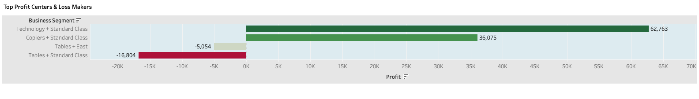
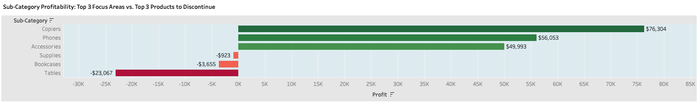
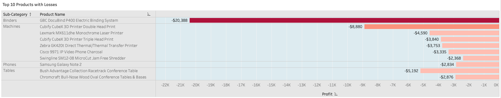
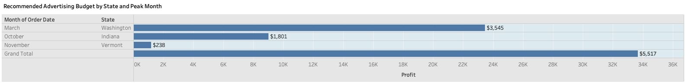
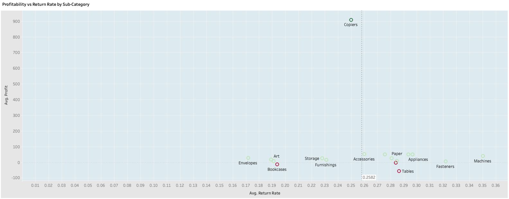
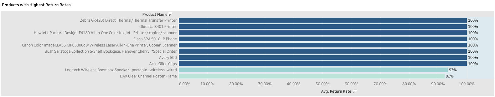
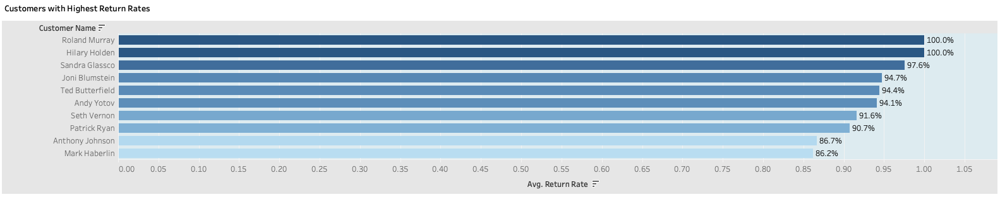

# Superstore Profitability & Strategic Analysis

**Author:** Richard Rivera Cartagena  
**Completion Date:** December 2025  
**Tools:** Tableau Desktop/Public, Excel  
**Skills Demonstrated:** Business Analytics, Data Visualization, Strategic Analysis, Profit Optimization

---

## 📊 View Live Dashboard

**[View Interactive Dashboard on Tableau Public](https://public.tableau.com/app/profile/richard.rivera.cartagena/viz/Richard_Rivera_Cartagena_Superstore_Analysis_Project/StrategicAnalysisDashboard?publish=yes)**

---

## 🎯 Project Overview

This project analyzes a struggling retail superstore's operations to identify opportunities for profitability improvement and strategic optimization. As a consultant, I was tasked with preventing bankruptcy by providing data-driven recommendations across three critical business areas:

1. **Product Profitability Analysis** - Identifying profit centers and loss-makers
2. **Advertising Investment Strategy** - Optimizing marketing spend by geography and seasonality
3. **Returns Risk Management** - Analyzing return patterns to reduce losses

The analysis examines approximately 10,000 orders and 800 returns to deliver actionable insights with an expected annual impact of **$27,000+** in profit improvement.

---

## 💼 Business Problem

The superstore was facing financial difficulties with unclear visibility into:
- Which products and categories were driving profits vs. losses
- Where to allocate limited advertising budgets for maximum ROI
- Whether high return rates were impacting profitability

Without data-driven insights, the business risked continuing to invest in unprofitable products and markets while missing opportunities in high-performing areas.

---

## 🔍 Analytical Approach

### Data Preparation
- **Primary Dataset:** Orders table (~10,000 records)
- **Secondary Dataset:** Returns table (~800 records)
- **Join Strategy:** LEFT JOIN to preserve all orders and identify returned items
- **Calculated Field:** Converted Returns field from text (null/"Yes") to numeric (0/1) for analysis

### Analysis Framework
I structured the analysis around three key business questions, creating targeted visualizations for each:

1. **Profitability Diagnostics**
   - Analyzed profit/loss across multiple dimensional pairs (sub-category + region, shipping mode + product, etc.)
   - Identified extreme profit centers and loss-makers
   - Evaluated individual product and sub-category performance

2. **Geographic & Temporal Analysis**
   - Calculated average profit by state and month
   - Identified seasonal trends and regional variations
   - Applied advertising budget framework (1/5 of profits as acceptable ad spend)

3. **Returns Analysis**
   - Calculated return rates by product, customer, and sub-category
   - Cross-referenced return rates with profitability metrics
   - Identified problematic patterns requiring intervention

---

## 📈 Key Findings

### 1. Profitability Analysis: Profit Centers & Loss-Makers



**Major Profit Drivers:**
- **Technology + Standard Class:** $62,763 profit (largest profit center)
- **Copiers + Standard Class:** $36,075 profit (second-largest profit center)
- Technology products (Copiers, Phones, Accessories) collectively generate **$182,000** in annual profit

**Critical Loss-Makers:**
- **Tables + Standard Class:** -$16,804 loss (largest loss-maker)
- **Tables + East Region:** -$5,054 loss (second-largest loss-maker)
- Tables sub-category alone loses **$23,067 annually** and should be discontinued



**Top 3 Sub-Categories to Focus On:**
1. Copiers: $76,304 profit
2. Phones: $56,053 profit
3. Accessories: $49,993 profit

**Top 3 Sub-Categories to Discontinue:**
1. Tables: -$23,067 loss
2. Bookcases: -$3,655 loss
3. Supplies: -$923 loss

**Expected Impact:** Eliminating underperforming products saves approximately **$28,000 per year**

---

### 2. Products Analysis: Individual SKU Performance



**Worst Performing Products:**
1. GBC DocuBind P400 Electric Binding System (Binders): -$20,388
2. Cubify CubeX 3D Printer Double Head Print (Machines): -$8,880
3. Lexmark MX611dhe Monochrome Laser Printer (Machines): -$4,590

Most loss-making products are in the **Machines** and **Tables** sub-categories, reinforcing the need to discontinue these lines.

---

### 3. Advertising Strategy: Geographic & Seasonal Optimization



**Top 3 State-Month Combinations for Advertising Investment:**

| Rank | State | Peak Month | Profit | Recommended Ad Budget |
|------|-------|------------|--------|----------------------|
| 1 | Washington | March | $3,545 | $709 |
| 2 | Indiana | October | $1,801 | $360 |
| 3 | Vermont | November | $238 | $48 |

**Investment Strategy:**
- **Total recommended advertising budget:** $2,210
- **Expected profit from these campaigns:** $11,049
- **ROI Framework:** Invest up to 1/5 of state-month profit in advertising (conservative approach)

These state-month combinations show consistently high profit per unit sold, making them ideal for targeted advertising campaigns.

---

### 4. Returns Risk Analysis



**Overall Returns Metrics:**
- **Total return rate:** 8% (800 returns out of 10,000 orders)
- **Highest-risk combination:** Tables sub-category has both negative profit (-$23K) AND 11% return rate

**Critical Insight:** The scatter plot reveals that Tables sits in the worst quadrant—high return rate combined with negative profitability. This double penalty makes it the highest-priority category for discontinuation.



**Products with 100% Return Rates:**
- Zebra GK420t Direct Thermal/Thermal Transfer Printer
- Okidata B401 Printer
- Hewlett-Packard Deskjet F4180 All-in-One Color Inkjet Printer
- Cisco SPA 501G IP Phone
- Canon Color ImageCLASS MF8580Cdw Wireless Laser All-in-One Printer
- Bush Saratoga Collection 5-Shelf Bookcase
- Avery 500

These products require immediate quality review or should be removed from inventory.



**High-Risk Customers (90-100% Return Rates):**
1. Roland Murray - 100%
2. Hilary Holden - 100%
3. Sandra Glassco - 97.6%
4. Joni Blumstein - 94.7%
5. Ted Butterfield - 94.4%

**Recommendation:** Review these customer accounts for potential fraud, serial returning behavior, or systematic product quality issues affecting their orders.

---

## 💡 Strategic Recommendations

### Immediate Actions (0-30 days)

1. **Discontinue Tables Sub-Category**
   - **Expected savings:** $23,067 annually
   - **Rationale:** Consistent losses across all regions, highest return rate (11%), no viable path to profitability

2. **Phase Out Worst-Performing SKUs**
   - Remove GBC DocuBind, Cubify CubeX 3D Printers, and other products with losses exceeding -$2,000
   - **Expected savings:** Additional $5,000+ annually

3. **Review High-Return Customer Accounts**
   - Investigate customers with 90%+ return rates
   - Implement account verification or purchase limits if fraud suspected

### Short-Term Initiatives (1-3 months)

4. **Launch Targeted Advertising Campaigns**
   - **Budget allocation:** $2,210 across Washington (March), Indiana (October), Vermont (November)
   - **Expected profit:** $11,049
   - **ROI:** 5:1 return on advertising spend

5. **Investigate Office Equipment Quality Issues**
   - Multiple products (Machines, Binders, Phones) show high return rates
   - Engage with suppliers to address quality concerns or find alternative vendors

### Long-Term Strategy (3-12 months)

6. **Double Down on Technology Category**
   - Copiers, Phones, and Accessories generate $182K in profit
   - Expand product selection in these high-performing categories
   - Consider premium positioning strategy

7. **Optimize Shipping & Regional Strategy**
   - Standard Class shipping combined with Technology products performs exceptionally well
   - Consider regional distribution centers to reduce costs while maintaining service levels

---

## 📊 Expected Financial Impact

| Initiative | Annual Impact |
|-----------|---------------|
| Discontinue Tables sub-category | +$23,067 |
| Eliminate worst-performing products | +$5,000 |
| Advertising campaign revenue | +$11,049 |
| Reduce returns (quality improvements) | +$3,000 (est.) |
| **Total Expected Improvement** | **$42,116** |

**Conservative estimate:** $27,000+ annual improvement  
**Optimistic scenario:** $42,000+ annual improvement

---

## 🛠️ Technical Implementation

### Tools & Technologies
- **Tableau Desktop/Public:** Primary visualization and analysis platform
- **Excel:** Data validation and initial exploration
- **Data Volume:** ~10,000 orders, ~800 returns

### Key Analytical Techniques
- **LEFT JOIN methodology:** Preserving all orders while identifying returns
- **Calculated fields:** Converting categorical returns data to numeric for aggregation
- **Multi-dimensional analysis:** Cross-tabulating profit/loss across category pairs
- **Temporal analysis:** Month-over-month profit trends by geography
- **Scatter plot analysis:** Correlating profitability with return rates

### Data Transformation
```
Returned Field Transformation:
- Original: Text field with "Yes" and null values
- Transformed: Numeric field (1 = returned, 0 = not returned)
- Purpose: Enable rate calculations and aggregations
```

---

## 📁 Repository Contents

- `README.md` - This documentation file
- `Richard_Rivera_Cartagena_Superstore_Analysis_Project.twbx` - Tableau workbook file
- `Richard-Rivera-Cartagena-Superstore-Analysis-Project.png` - Dashboard overview
- `top_profit_centers_and_loss_makers.png` - Profit/loss by business segment
- `sub_category_profitability_top-3_focus_areas_vs_top_3_products_to_discontinue.png` - Category analysis
- `top_10_products_with_losses.png` - Individual SKU performance
- `recommended_advertising_budget_by_state_and_peak_month.png` - Ad spend recommendations
- `profitability_vs_return_rate_by_sub_category.png` - Returns correlation analysis
- `products_with_highest_return_rates.png` - Product-level returns
- `customers_with_highest_return_rates.png` - Customer-level returns

---

## 🚀 How to Use This Repository

### Viewing the Analysis

1. **Interactive Dashboard (Recommended):**
   - Visit the [Tableau Public link](https://public.tableau.com/app/profile/richard.rivera.cartagena/viz/Richard_Rivera_Cartagena_Superstore_Analysis_Project/StrategicAnalysisDashboard?publish=yes) for full interactivity
   - Filter by region, category, or time period
   - Hover over visualizations for detailed tooltips

2. **Download Tableau Workbook:**
   - Download the `.twbx` file from this repository
   - Open with Tableau Desktop or Tableau Reader (free)
   - Explore underlying data and calculations

3. **Static Visualizations:**
   - View PNG images directly in this README or repository

---

## 🎓 Skills Demonstrated

This project showcases proficiency in:

✅ **Business Analytics**
- Profit/loss analysis across multiple dimensions
- ROI calculation and advertising budget optimization
- Risk assessment (returns analysis)

✅ **Data Visualization**
- Creating clear, actionable dashboards for executive decision-making
- Using appropriate chart types for different analytical questions
- Designing visualizations that tell a coherent business story

✅ **Strategic Thinking**
- Translating data insights into concrete business recommendations
- Prioritizing initiatives by expected financial impact
- Balancing short-term wins with long-term strategy

✅ **Technical Skills**
- Advanced Tableau techniques (calculated fields, joins, dual-axis charts)
- Data transformation and cleaning
- Dashboard design and user experience

---

## 📧 Contact

Richard Rivera Cartagena
[LinkedIn](https://www.linkedin.com/in/richard-rivera-cartagena/) · [GitHub](https://github.com/RichRC)

I'm actively seeking opportunities in data analytics, business intelligence, and strategic consulting. If you'd like to discuss this project or potential opportunities, please reach out!

---

## 📝 License

This project is available for portfolio and educational purposes. The underlying Superstore dataset is a sample dataset commonly used for educational purposes.

---

## 🙏 Acknowledgments

This analysis was completed as part of a business analytics project to demonstrate proficiency in data visualization, strategic analysis, and business consulting skills. The Superstore dataset represents a realistic retail scenario requiring actionable insights to prevent business failure.

---

*Last Updated: December 2025*
